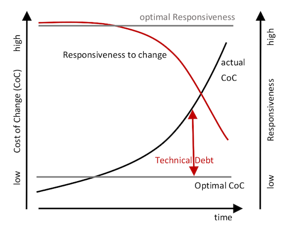
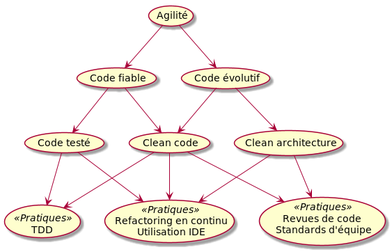

# Clean Code : introduction

§§

## Qualité du code et dette technique



Note:

On parle de clean code, parce que par opposition, il y a du code "pas clean".
Ce "code pas clean" est fortement lié à ce que l'on appelle la dette technique d'un logiciel.
La dette technique augmente de manière "naturelle" avec l'ajout de fonctionnalités, on parle d'entropie du logiciel.
Elle impacte les coûts et délais d'évolution = une évolution devient de plus en plus coûteuse et de plus en plus longue à effectuer.
Dans ce diagramme on voit que le coût et la durée des dévloppement vont augmenter de façon exponentielle lorsque la dette technique s'accroît.

Il est donc indispensable de maîtriser la dette technique pour garder un rythme/coût d'évolution soutenable.
Clean code est un des éléments qui permet de maîtriser la dette.

Voir la présentation très intéressante d'Arnaud Lemaire sur le sujet : https://www.youtube.com/watch?v=VKe9EE4MUxk

§§

## Est-ce si grave ?

<!-- .element: height="350px" -->

> Le code **pourrit**<br>
> Le code **pourri** attire le code **pourri**

§§

## Est-ce si grave ?

<!-- .element: height="300px" -->

> Don't leave with **broken windows**<br>(Andrew Hunt and David Thomas)

§§

## Maitriser la dette

Des pratiques pour maintenir la **fiabilité** et l'**évolutivité**




Note:

Code fiable = du code sans bugs, qui répond aux besoin du client (= à l'intention)
Code évolutif = du code dans lequel on peut ajouter des fonctionnalités avec un cout minimum


Source du diagramme (rq : possible d'utiliser le plugin plant uml avec intellij)

@startuml

usecase agilite as "Agilité"
usecase codefiable as "Code fiable"
usecase codeevolutif as "Code évolutif"
usecase codeteste as "Code testé"
usecase cleancode as "Clean code"
usecase cleanarchi as "Clean architecture"
usecase tests as "TDD" <<Pratiques>>
usecase refacto as "Refactoring en continu\nUtilisation IDE" <<Pratiques>>
usecase revues as "Revues de code\nStandards d'équipe" <<Pratiques>>

(agilite) -down-> (codefiable)
(agilite) -down-> (codeevolutif)
(codefiable) -down-> (codeteste)
(codefiable) -down-> (cleancode)
(codeevolutif) -down-> (cleancode)
(codeevolutif) -down-> (cleanarchi)
(codeteste) -down-> (tests)
(codeteste) -down-> (refacto)
(cleancode) -down-> (refacto)
(cleancode) -down-> (revues)
(cleancode) -down-> (tests)
(cleanarchi) -down-> (revues)
(cleanarchi) -down-> (refacto)

@enduml

§§

## Exemple : que fait ce code ?

```
public void updateQuality() {
    for (int i = 0; i < items.length; i++) {
        if (!items[i].name.equals("Aged Brie")
                && !items[i].name.equals("Backstage passes to a TAFKAL80ETC concert")) {
            if (items[i].quality > 0) {
                if (!items[i].name.equals("Sulfuras, Hand of Ragnaros")) {
                    items[i].quality = items[i].quality - 1;
                }
            }
        } else {
            if (items[i].quality < 50) {
                items[i].quality = items[i].quality + 1;

                if (items[i].name.equals("Backstage passes to a TAFKAL80ETC concert")) {
                    if (items[i].sellIn < 11) {
                        if (items[i].quality < 50) {
                            items[i].quality = items[i].quality + 1;
                        }
                    }

                    if (items[i].sellIn < 6) {
// etc...
```

§§

## Exemple : que fait ce code ?

```
public void updateQuality() {
	for (int i = 0; i < items.length; i++) {
		updateItem(items[i]);
	}
}
	
private void updateItem(Item item) {

	if (item.name.equals(SULFURAS_SPECIAL_ITEM)) { return; }
	
	decrementSellinDateByOneDay(item);
		
	if (item.name.equals(AGED_BRIE_ITEM)) {
		updateQualityForAgedBrieItems(item);
	} else if (item.name.equals(BACKSTAGE_CONCERT_ITEM)) {
		updateQualityForBackstageItems(item);
	} else {
		updateQualityForNormalItems(item);
	}
}

private void updateQualityForNormalItems(Item item) {
	decreaseQualityIfGreaterThan0(item);
	if (item.sellIn < MINIMUM_SELLIN_DELAY_FOR_NORMAL_ITEMS) {
		decreaseQualityIfGreaterThan0(item);

	}
}
// etc...

```

§§

## Clean code =

> Un code facile à **comprendre** et à faire **évoluer**

1. exprime clairement les **intentions**
2. propose des **abstractions de qualité**
3. **testable**

Remarque : 1 et 2 s'appliquent aussi au code des tests

§§

## Clean architecture =

> Une architecture (logicielle) facile à **comprendre** et à faire **évoluer**

1. exprime clairement les **intentions**
2. propose des **abstractions de qualité**
3. **testable**


Même définition que pour le code

... mais au niveau de la **structure** du logiciel (composants/packages)

... et de ses **dépendances externes**

Note:

Pas de séparation stricte entre ce que l'on fait dans clean code et clean architecture.
Les 2 s'intéressent au design, cela n'est qu'une histoire de granularité, et de là où l'on met le curseur.
Concrètement au niveau de l'architecture, on va regarder comment les composants travaillent entre eux et avec l'extérieur.

§§

## Comment faire ?

Soigner le **code**

* Nommage, fonctions, classe
* Commentaires (la juste dose)
* Duplication (DRY)
* Step-down rule
* etc

§§

## Comment faire ?

Soigner la **qualité des abstractions** (= le design)

* Principes SOLID
* Loi de Demeter
* S'inspirer des patterns

§§

## Comment faire ?

Adopter un **process de dévelopement** approprié

* TDD
* Refactoring continu
* YAGNI / KISS
* Code qui marche, puis code de qualité, puis code performant
