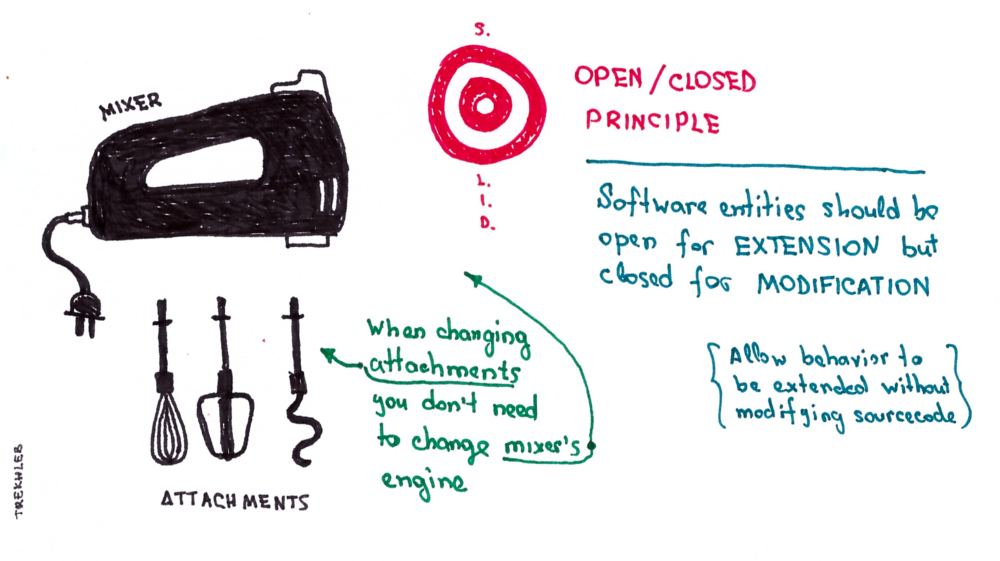

## Principes SOLID

<table>
    <tr><td>Responsabilité unique     </td><td>**S**ingle responsibility principle</td></tr>
    <tr><td>Ouvert/fermé              </td><td>**O**pen/closed principle</td></tr>
    <tr><td>Substitution de Liskov    </td><td>**L**iskov substitution principle</td></tr>
    <tr><td>Ségrégation des interfaces</td><td>**I**nterface segregation</td></tr>
    <tr><td>Inversion des dépendances </td><td>**D**ependency inversion</td></tr>
</table>

Note:

Ensemble de principes de conception applicables en **programmation Objet**

§§

## Responsabilité unique

 <!-- .element: height="550px" -->

Note:

Symptomes : classes "divines", classes difficiles à tester unitairement avec des mocks dans tous les sens

CRC (Class-responsibility-collaboration) Cards, ...

§§

## Responsabilité unique // BAD

```java
    public class UserService {
        private Database database;
        private SmtpClient smtpClient;
        private MailFormatter formatter;

        public void Register(String email, String password) {
            byte[] hash = addSaltAndHash(password);
            User user = new User(email, hash);
            // Do anything required
            database.save(user);
            smtpClient.send(buildMessage(email));
            // Deal with send failures ??
        }
        private MailMessage buildMessage(String email) {
            String body = formatter.format(email);
            new MailMessage("donotreply@company.com", email, body);
        }
    }
```

Note:

Si je dois changer le format du mail, gérer une bufferisation des mails, ... , je vais devoir modifier le UserService.

Solution:
* séparer la logique d'enregistrement d'un nouvel utilisateur, de celle de la gestion des notifications.
* créer un MailService qui prend la responsabilité de gérer le serveur Smtp, le formatage du mail, ...

§§

## Responsabilité unique // GOOD

```java
    public class UserService {
        private Database database;
        @Autowired
        private MailService mailService;

        public void Register(string email, string password) {
            byte[] hash = addSaltAndHash(password);
            User user = new User(email, hash);
            // Do anything required
            database.Save(user);
            mailService.sendRegistrationNotification(email);
        }
    }
```

§§

## Ouvert/fermé

 <!-- .element: height="550px" -->

Note:

Les classes, méthodes, ... devraient être ouvertes à l'extension, mais fermées à la modification

Symptomes : instanceOf, switch

§§

## Ouvert/fermé // BAD

```java
    public class MailService {
        public void sendNotification(Event event, String email) {
            String body;
            if (event instanceof RegistrationEvent) {
                body = "Welcome";
            } else if (event instanceof SuspiciousLoginEvent) {
                body = "A suspicious login attempt was logged from "
                    + ((SuspiciousLoginEvent) event).getCountry();
            } else {
                throw new UnsupportedOperationException(event.getClass().getName());
            }
            smtpClient.send(MailMessage("donotreply@company.com", email, body));
        }
    }
```

Note:

Il n'est pas possible d'étendre la logique de notification sans modifier la méthode send.

Solution :
* abstraction, polymorphisme
* services/beans (couche métier toussa toussa)

§§

## Ouvert/fermé // GOOD

```java
    public class MailService {
        public void send(Event event, String email) {
            String body = event.getUserMessage();
            smtpClient.send(MailMessage("donotreply@company.com", email, body));
        }
    }

    public class SuspiciousLoginEvent implements Event {
        @Override
        public String getUserMessage() {
            "A suspicious login attempt was logged from " + country;
        }
    }
```

Note:

Autre exemple un peu plus complexe avec une intrication plus complexe à "casser" :

```java
    public interface Expression {
        void print(StringBuffer buffer);
    }

    public class Addition implements Expression {
        Expression leftExpression;
        Expression rightExpression;

        void print(StringBuffer buffer) {
            leftExpression.print(buffer);
            buffer.append("+");
            rightExpression.print(buffer);
        }
    }

    public class Literal implements Expression {
        String value;

        void print(StringBuffer buffer) {
            buffer.append(value);
        }
    }
```

Il n'est pas possible de changer la logique d'affichage ou en ajouter une sans modifier chacune des expressions.

Solution :
* pattern visiteur : permet de découpler la logique de parcours de graphe du traitement d'affichage (on détaille ???)

§§

## Substitution de Liskov

 <!-- .element: height="550px" -->

Note:

Si T' est un sous-type de T, alors toute instance de T doit pouvoir être remplacée par une instance de T' sans que cela ne corrompte le programme

-> L'exemple présenté sur le Open/Closed principle viole également le principe de Liskov en réalité...

§§

## Substitution de Liskov // BAD

```java
    public interface User {
        String getLogin();
        RemunerationMode getRemunerationMode();
    }

    public class Client implements User {
        // ...

        @Override
        public RemunerationMode getRemunerationMode() {
            return null;
        }
    }
```

Note:

§§

## Substitution de Liskov // GOOD

```java
    public interface User {
        String getLogin();
    }

    public interface Employee extends User {
        RemunerationMode getRemunerationMode();
    }

    public class Client implements User {
    }

    public class Manager implements Employee {
    }
```

Note:

La notion de "est un" qui parait évidente dans le monde réel ne l'est pas forcément dans la programmation : un carré est-il un rectangle ??
Il vaut souvent mieux privilégier la maintenabilité du code à une modélisation "parfaite" du monde réel

Solutions parmi d'autres:
* revoir la conception et l'arbre d'héritage
* ségrégation des interfaces !!
* utilisation de la composition/délégation plutôt que l'héritage si un comportement n'est en réalité pas réellement partagé par l'ensemble des sous-classes, mais qu'on veut simplement éviter de dupliquer du code

-> Covariance, contravariance, on détaille ????

§§

## Ségrégation des interfaces

 <!-- .element: height="550px" -->

Note:

§§

## Ségrégation des interfaces // BAD

```java
    public interface MotorVehicle {
        void addFuel(int galons);
        void openDoors();
    }

    public class MotorBike implements MotorVehicle {
        @Override
        public void addFuel() {
            // OK
        }

        @Override
        public void openDoors() {
            // What the fuck ??!!
            // Can I really do that without violating Liskov principle ?
        }
    }
```

Note:

§§

## Ségrégation des interfaces // GOOD

```java
    public interface MotorVehicle {
        void addFuel(int galons);
    }
    public interface HasDoors {
        void openDoors();
    }

    public class MotorBike implements MotorVehicle {
        @Override
        public void addFuel() {
            // ...
        }
    }
    public class Truck implements MotorVehicle, HasDoors {
        @Override
        public void addFuel() {
            // ...
        }

        @Override
        public void openDoors() {
            // ...
        }
    }
```

Note:

-> Il reste possible de factoriser le code du addFuel... Délégation, classes abstraites, ...

§§

## Inversion des dépendances

 <!-- .element: height="550px" -->

Note:

§§

## Inversion des dépendances // exemple


Note:
