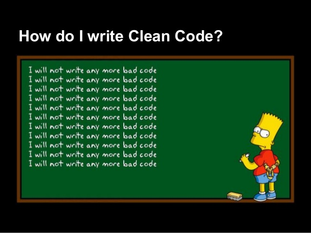
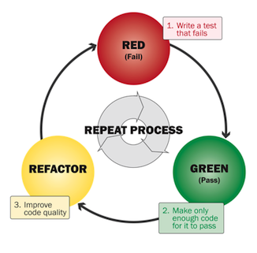

# Adopter un processus de développement approprié

§§

## Faire simple

> Un système complexe peut difficilement se concevoir **en une fois**  et **en avance de phase**

* **KISS** "Keep it simple stupid"
* **YAGNI** You ain't gonna need it  = Pas de code/conception "en prévision de"

Mise sur la capacité à **itérer rapidement**  plutôt qu'**anticiper des besoins incertains**

§§

## Supprimer les duplications

- **DRY** = Don't repeat yourself (Kent Beck / TDD)

- **Règle de 3**

  * un élément répliqué 2 fois = warning
  * 3 fois = action !

- Eviter les **copier-coller** => Extract Method (Ctrl+Alt+M)

§§

## Faire les choses dans l'ordre

Et plus globalement :

1. Faire du code qui **marche** (RED-GREEN)
2. Faire du code de **qualité** (REFACTOR / Story technique)
3. Faire du code **performant** (si pb de perf avéré)

