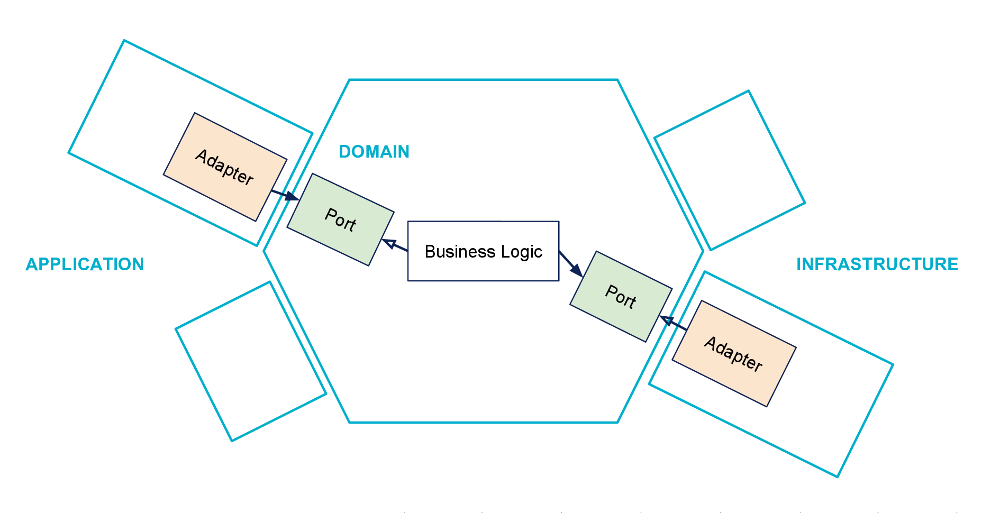

## Hexagonal architecture

Source : https://blog.octo.com/architecture-hexagonale-trois-principes-et-un-exemple-dimplementation/

§§

## Principes

- Séparer application / domaine / infrastructure
- Testabilité
- Préserver le modèle

§§

## kata Happy Town

Pour accueillir dignement ses nouveaux habitants, le conseil municipal de HappyTown a décidé d’offrir un cadeau à tous ses habitants qui soufflent leur première bougie dans la commune.

§§

## kata Happy Town

Le rôle de notre application est donc :

* De sélectionner les habitants éligibles à l’obtention d'un cadeau (ils ont emménagés depuis plus de 1 an)
* Pour chacun des habitants éligibles :
 - Trouver le cadeau approprié en fonction de son âge
 - Envoyer un mail annonçant l'attribution du cadeau
 - Envoyer un mail récapitulatif au service cadeau de la mairie avec tous les cadeaux attribués de la journée