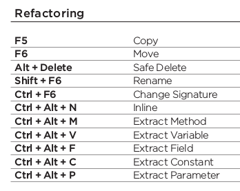
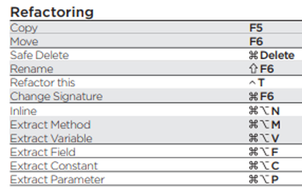

# Annexes

§§

## Code smells : c'est quoi un code "pas clean" ?

* Nommage pas clair, pas explicite par rapport à l'intention
* Grosses classes / Grosses méthodes
* Mutliples niveaux d'indentation
* Nombreux paramètres
* Duplication
* Code mort
* Commentaires sans valeur, faux
* Nombreuses dépendances
* Tests difficiles
* ...

Voir https://refactoring.guru/refactoring/smells

§§

## IDE : refacto et génération de code

L'IDE sait faire beaucoup de choses

* générer du code / le modifier
* travailler sur les conditions
* détecter les duplications, etc...

Intérêt

* Le refacto devient plus fiables / rapide
* Encore plus via raccourcis clavier
* Il suffit de connaitre une dizaine d'actions ([Voir ici](http://arlobelshee.com/the-core-6-refactorings/))

§§

## IDE : Raccourcis

* Intellij, menu Help/Keymap Reference
* Find actions : Ctrl+Maj+A / Command+Maj+A
* Plugin KeyPromoter X

 <!-- .element: style="display: inline; width: auto;" -->
 <!-- .element: style="display: inline; width: auto;" -->