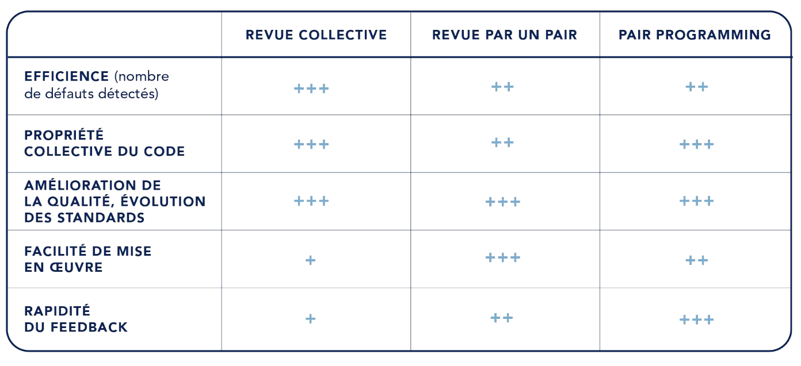

# La revue de code

Lionel DURAND<!-- .element: class="auteur" -->

Avril 2023<!-- .element: class="date" -->

lioneldurand@gmail.com https://www.linkedin.com/in/lionel-durand-649b72193/
<!-- .element: class="auteur" -->

---

# Pourquoi faire des revues ?

--

## Pourquoi faire des revues ? 1/3

Pour produire un meilleur code 

* qui fait ce qu'on attend de lui  <!-- .element: class="fragment" -->
  * valider le fonctionnel
  * trouver des bugs
  * trouver des bugs le plus tôt possible
* qui est maintenable <!-- .element: class="fragment" -->
  * testable et testé
  * simple à comprendre 

--

## Pourquoi faire des revues ? 2/3

Pour améliorer la maitrise collective du code

* parler du code entre membres de l'équipe <!-- .element: class="fragment" -->
* encourager la propriété collective du code <!-- .element: class="fragment" -->
* partager les responsabilités <!-- .element: class="fragment" -->
* partager les standards de dév <!-- .element: class="fragment" -->
* faire évoluer les standards de dév <!-- .element: class="fragment" -->

Notes:

Indiquer que faire du code c'est un travail d'équipe

L'enjeux c'est de faire à plusieurs et pas de reposer sur un seul dév qui maitrise

--

## Pourquoi faire des revues ? 3/3

Pour apprendre

* montée en compétence des nouveaux arrivants
* l'auteur apprend des retours du relecteur 
* le relecteur apprend du code de l'auteur

---

# Quels types de revues ?

--

## Comment et par qui ?

Pas de définition unique, pas de modalité unique

> Il faut que le tech lead valide toutes les revues de code

> Il faut au moins 1 relecteur en plus de l'auteur 

> Il faut qu'au moins 2 membres de l'équipe participent à l'écriture du code

> Ici, tout est développé en mob programming

--

## Qui valide la revue ?

|   |   |
|---|---|
| Les architectes de l'entreprise |  =>  Oligarchie |
| Le tech lead de l'équipe | => Autocratie |
| L'équipe | => Démocratie => Démocratie participative (représentant tournants) |
| Toute l'équipe | => Holacratie =>  Anarchie (personne ne décide) |

--

## Les types de revues courants

Ecriture puis relecture (asynchrone)

* Revue par un ou plusieurs pairs
* Revue "par dessus l'épaule"
* Revue formelle (durée, périmètre)
* Revue via un outil (ex gitlab)

Ecriture à plusieurs (feedbacl temps réel)

* Pair programming
* Mob programming

--

## Les types de revues courants

Notes:

# Mode opératoire

## Organiser la revue

* Périmètre limité, à définir au préalable
* Pour les modes synchrones, durée limitée (1h)

* 1 heure pour 

Aide à la revue

* checklist
* standards

## Pair programming et mob programming

* Durée limitée
* Pair programming
  * rôle de navigateur et de scribe
  * inversion des rôles régulière
* Mob programming
  * plusieurs navigateurs, un scribe, un grôle de scribe 

---

# Défauts courants et bonnes pratiques

--

## La revue n'améliore pas la qualité du code

Symptômes

* Le nb de bugs ne diminue pas
* Le code reste peu lisible
* Notre vélocité diminue
* La dette technique augmente

--

## La revue n'améliore pas la qualité du code

Bonnes pratiques

* qu'est ce que les revues doivent apporter à l'équipe ?
* travailler sur des standards de code
* les construire progressivement
  * traiter les plus grosses douleurs en premier
  * compléter les standards au fur et à mesure
* checklist de points d'attention prioritaires pour les revues
* alterner les types de revues, pour faire du pair programming, du mob programming

--

## Le process de revue prend trop de temps

Symptômes

* Multiples allers-retours entre l'auteur et le relecteur
* On s'attend
* Il faut rebaser plusieurs fois
* On n'arrive pas à prendre de décision
* On ne se comprend pas

--

## Le process de revue prend trop de temps

Bonnes pratiques :

* plus le périmètre est petit, plus c'est efficace : 2 merge requests valent mieux qu'une ! 
* prioriser la relecture sur toutes les autres taches
* se prévenir pour ne pas s'attendre
* formaliser le processus de décision
  * à l'écrit, catégoriser les retours : [FIX], [OPT], [QUESTION]
  * à l'oral : time boxer, décider vite ou reporter
* être précis et univoque, demander si on n'est pas sur 
* standards de code et check liste

--

## La revue est mal vécue

Sympômes

* Peur d'être mis en défaut
* Sentiment de reproche
* Sentiment de ne pas être écouté
* Tensions

--

## La revue est mal vécue

Bonnes pratiques

* soigner la communication
* apprendre à donner et recevoir des feedbacks
* dépersonnaliser : "le code produit un bug" plutôt que "ton bug"
* partager la responsabilité : "nous" plutôt que "tu" ou "je"
* relecteur : faire aussi des retours sur ce qui est bien
* auteur : dire quand on se sent mal

--

## Donner et recevoir du feedback

La CNV appliquée à la revue de code

* 1/ observation : ce que je vois
  * "cette fonction fait 30 lignes"
* 2/ inférence et impact : l'impact que j'imagine sur le code ou l'équipe
  * "la prochaine fois qu'on va intervenir dessus, on va avoir du mal à comprendre"
* 3/ demande éventuelle : ce que je propose
  * "peut-être qu'on pourrait la découper en plusieurs fonctions"

--

## Programmation sans ego

[J. Weinberg, The Psychology of Computer Programming](https://www.goodreads.com/book/show/1660754.The_Psychology_of_Computer_Programming)

1. Comprends et accepte que tu feras des erreurs
2. Tu n'est pas ton code
3. Même si tu connais beaucoup de "prises", il y a quelqu'un de meilleur que toi
4. Ne réécris pas un code sans consultation préalable
5. Traite ceux qui en savent moins que toi avec respect, déférence et patience
6. La seul chose constante dans le monde c'est le changement
7. La seule véritable autorité émange de la connaissance, pas du pouvoir
8. Bats-toi pour ce que tu crois, mais accepte gracieusement la défaite
9. Ne t'isole pas au fond de la pièce
10. Critique le code, pas la personne. Soit gentil avec les développeurs, pas avec le code

Notes: 

1. Comprenez et acceptez que vous ferez des erreurs. Le but est de les trouver tôt, avant qu'elles n'entrent en production. Heureusement, à l'exception des quelques-uns d'entre nous qui développons des logiciels de guidage de fusée au JPL, les erreurs sont rarement fatales dans notre industrie, nous pouvons donc et devons apprendre, rire et passer à autre chose.

2. Vous n'êtes pas votre code. N'oubliez pas que le but d'un examen est de trouver des problèmes, et des problèmes seront trouvés. Ne le prenez pas personnellement quand on est découvert.

3. Peu importe combien de « karaté » vous connaissez, quelqu'un d'autre en saura toujours plus. Une telle personne peut vous apprendre de nouveaux mouvements si vous le demandez. Recherchez et acceptez les commentaires des autres, surtout lorsque vous pensez que ce n'est pas nécessaire.

4. Ne réécrivez pas le code sans consultation. Il y a une ligne fine entre "code de correction" et "code de réécriture". Connaissez la différence et poursuivez les changements stylistiques dans le cadre d'une révision de code, et non en tant qu'exécuteur solitaire.

5. Traitez les personnes qui en savent moins que vous avec respect, déférence et patience. Les personnes non techniques qui traitent régulièrement avec les développeurs sont presque universellement d'avis que nous sommes au mieux des prima donnas et au pire des pleurnichards. Ne renforcez pas ce stéréotype avec colère et impatience.

6. La seule constante dans le monde est le changement. Soyez ouvert et acceptez-le avec le sourire. Considérez chaque modification de vos exigences, de votre plate-forme ou de votre outil comme un nouveau défi, et non comme un inconvénient sérieux à combattre.

7. La seule véritable autorité découle de la connaissance, pas de la position. La connaissance engendre l'autorité, et l'autorité engendre le respect - donc si vous voulez le respect dans un environnement sans ego, cultivez la connaissance.

8. Combattez pour ce en quoi vous croyez, mais acceptez la défaite avec grâce. Comprenez que parfois vos idées seront rejetées. Même s'il s'avère que vous avez raison, ne vous vengez pas ou ne dites pas "je vous l'avais dit" plus de quelques fois au maximum, et ne faites pas de votre chère idée disparue un martyr ou un cri de ralliement.

9. Ne soyez pas "le gars dans la pièce". Ne soyez pas le gars qui code dans le bureau sombre et qui n'émerge que pour acheter du cola. Le gars dans la pièce est hors de contact, hors de vue et hors de contrôle et n'a pas sa place dans un environnement ouvert et collaboratif.

10. Critiquez le code plutôt que les gens - soyez gentil avec le codeur, pas avec le code. Autant que possible, faites en sorte que tous vos commentaires soient positifs et orientés vers l'amélioration du code. Reliez les commentaires aux normes locales, aux spécifications du programme, à l'amélioration des performances, etc.

---

# Les merge requests

--

## Revues en ligne

Selon l'outil : Merge request (gitlab), pull request (github), ou autre...

Principes similaires
  * l'auteur demande la fusion de sa branche via l'outil
  * le relecteur peut commenter
  * l'auteur peut valider et merger

De plus en plus utilisé

--

## Revue via des merge requests

Les plus :

* asynchrone avec process formel
* le relecteur fait ses remarques "dans le code"
* l'auteur voit les remarques sous forme de TODO liste
* intégration au workflow git & gestion des issues
* suivi

--

## Via un outil : Les merge requests

Les points de vigilance :

* asynchrone : on risque de s'attendre 
* remarques par écrit : favorise l'incompréhension et les tensions

=> mettre en oeuvre les bonnes pratiques vue précédemment

=> combiner avec d'autres modes de revue (synchrones)

---

# Conclusion

--

## Conclusion

> Des gains pour le produit (qualité), pour l'équipe (collaboration), et pour ses membres (apprentissage)

> Accepter de passer du temps à lire du code (plutôt que d'en écrire)

> Formaliser (et faire vivre) un process de revue adapté au projet et à ses membres

--

## Ressources

[Livre blanc Culture Code](https://publication.octo.com/fr/telechargement-livre-blanc-culture-code) de Octo

