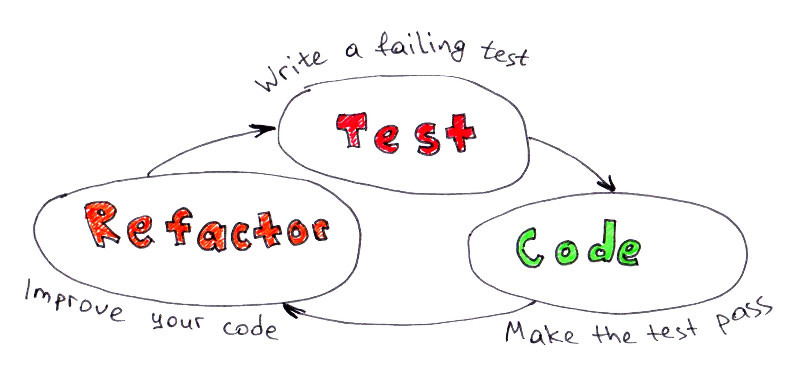
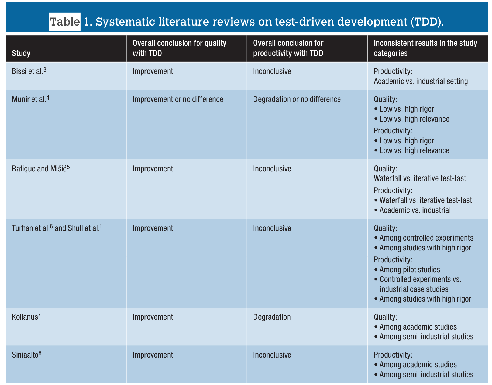

# Les bases du TDD

Lionel DURAND<!-- .element: class="auteur" -->

Avril 2023<!-- .element: class="date" -->

lioneldurand@gmail.com https://www.linkedin.com/in/lionel-durand-649b72193/
<!-- .element: class="auteur" -->

---

## Ice breaker

* Vos attentes ?
* Vos questions p/r au TDD ?
* Comment vous pratiquez les tests aujourd'hui ?
* Vos douleurs p/r aux tests aujourd'hui ?

---

## Plan

* J1 : Les bases du TDD
    * Kata Password Verifier
    * Mock & stub, Kata Greeting service
* J2 : TDD sur du code existant
    * Kata Trip service
    * Kata Tennis
* J3 : TDD avec dépendances
    * Kata Roulette
* J3 Bonus
    * TDD sur votre code / TDD legacy advanced

Notes:

Timing ajusté après formation avril 2023 (ils sont allé plus vite que d'autres groupes)
=> prévoir en J1 et J2 des kata additionnels à sortir au besoin
Jour 1 :
* Début 9h30
  * Intro+ice breaker : 30'
  * Slides pres TDD : 15'
  * Kata prime factor : 30'
  * Slides / blabla recap cycle : 15'
* Pause 11h, 15'
* Password Sprint 1 + rétro (1h)
  * Binomes, expliquer les règles du fonctionnement (chacun code, rétro à la fin)  
* Pause dej 12h15 14h
* Password sprint 2 1h
  * On garde les mêmes binomes 
* Pause 15h 15'
* Kata Greeting service 1h
  * Live coding greeting service => pour expliquer ce que sont les mock & stub 30'
  * Greeting service kata => 1h, on change les binômes
* Fin 16H => on pourrait rentrer le début d'un kata pour ancrer le TDD from sratch, par ex bowling, ou autre plus plus sur les RG 

Jour 2 :

* Recap journée précédante, revue des questions 15'
* Slides TDD sur code existant 30 ''
* Trip Service (part 1, couverture de test) 1h
  * live coding pour montrer
  * puis ils refont
* Trip service refacto 1h
  * ils enchainent sur la partie refacto du kata
  * debrieffing 15' +  slides bilan du kata
* Pause midi
* Le kata trip service peut déborder sur l'aprem
* Si pas le cas, on peut faire Gilded Rose : durée 1h30 / 2h
  * Sprint 1 : 30'/45' tests de caractérisation
  * Sprint 2 : 45' refacto
  * Démo/revue de code collective/bilan
* Tennis : 1h
  * leur demander 12 noms techniques et les écrire au tableau
  * avec un dé ils choississent les noms

Jour 3 :

* Récap : 15'
* Slides Stratégie de test : 15'
* Roulette

---

## TDD : VRAI / FAUX ?

<blockquote style="font-size:48px">TDD est une technique de test qui consiste à couvrir de TU un programme</blockquote>

--

## TDD : VRAI / FAUX ?

<blockquote style="font-size:48px;text-decoration:line-through;">TDD est une technique de test qui consiste à couvrir de TU un programme</blockquote>
<blockquote style="font-size:48px">TDD est une technique de développement qui utilise les tests d'abord comme un moyen pour spécifier</blockquote>

--

## TDD = Test Driven Development

* TDD met l'accent non sur les tests, mais sur l'expression de l'intention
* C'est une pratique qui vise à aider le développeur à réfléchir avant d'écrire son code
* La couverture par les tests du code ainsi réalisé est un bénéfice collatéral de la méthode, et non son but

--

## TDD : le cycle red/green/refactor

Notes:
* évolution : cycle V (design=>code=>test), puis test-first(design-test-code). Avec TDD (test-code-design)
* "Code" : écrire le code necessaire et suffisant pour que le test passe

--

## TDD : Comment ?

* identifier les tests à écrire
* pas de code sans test préalable
* le test doit d'abord être rouge
* écrire juste le code nécessaire pour faire passer le test...pas plus
* puis refactorer, en apportant le même soin au code des tests qu'au code fonctionnel
* faire des petits pas, revenir en arrière (au vert) si besoin

---

## TDD : Pourquoi ?

* Feedback temps réel : plus de "tunnel" de dév, debugging simplifié

* Refactoring facilité/permanent, faisable sur du legacy

* Documentation par les tests

* Design testable => design modulaire

Voir [les 3 lois du TDD](http://www.butunclebob.com/ArticleS.UncleBob.TheThreeRulesOfTdd) ou la
[Conference Advanced TDD](https://vimeo.com/97516288), par Uncle Bob

Notes:

* est-ce que vous vous êtes déjà retrouvés dans un situation ou le projet ne compile plus ?
  ou rien ou partie ne marche plus? ou il se passe plusieurs jours/semaine avant d'avoir quelque chose
  de "commitable"?  imaginez que tout marchait il y a 1/ 5 ou 10 minutes, et qu'on peut revenir
  à un état stable...
* est-ce que vous vous êtes déjà retrouvés face à un code pourri que vous n'osez pas modifier de peur
  de le casser? imaginez pouvoir refactorer serenement...
* est-ce que vous avez déjà eu à modifier une partie de code que vous ne connaissez pas, ou vous plus?
  imaginez d'avoir des exemples de code qui montrent s'en servir et ce que ça fait.
* est-ce que vous avez déjà essayé d'ecrire des tests "à posteriori"? comment s'était? c'est difficile
  de tester un code qui n'a pas été pensé pour, souvent s'est trop couplé.  pour tester un module isolement
  on doit le découpler, un code testable est un code modulaire.

--

## TDD : Coûts / Benefices

    Extrait de IEEE Software - Juillet/Aout 2018
    <a href="https://www.cse.unr.edu/~dascalus/Paper_JAMES.pdf">What Do We (Really) Know about Test-Driven Development?</a>

Notes:
# TODO : update notes
- 15 ans d'études sur l'ffectivité du TDD, synthétisés periodiquement dans des études secondaires,
  qui montrent des contradictions sur les études de base
- cette publication analyse les resultats de plusieures "systematic reviews" sur le TDD
- une "revue systematique" est une étude qui analyse l'evidence apporté par plusieures études sur un sujet
  (analogie avec le domaine pharmaceutique, que sait-on de l'efficacité d'un traitement)

--
## TDD : Coûts / Benefices

* Amélioration de la qualite interne / externe
* Parfois impact négatif sur la productivité
* Des contradictions entre les differentes études, influence du contexte
* Niveau d'adherence au "protocole" TDD non précisé par les études

=> Developper son propre jugement sur ce qu'on peut attendre du TDD dans un contexte donnée.
Faire des essais, évaluer le résultat et ajuster.

---

## Exemple : Prime factors

Décomposer en facteurs premier un nombre n

Quels tests ?

* 1 => []
* 2 => [2]
* 3 => [3]
* 4 => [2*2]
* 15 => [3*5]
  ...

https://github.com/duduyo/kata-prime-factors-java

--

## Prime factors : bilan

* choisir les tests, leur ordre
* l'intention avant l'implémentation = construire les composants depuis l'extérieur
* petits pas dans les tests / petits tests
* petits pas lors du refacto : ne pas casser
* attendre pour refactorer ("just in time")
* maléabilité du code
* outillage (IDE)

---

## Mise en pratique

Kata "Password validator"

Pour commencer :

https://github.com/duduyo/kata-bootstrap-java

--

## Validation de mot de passe

Créer un classe qui valide des mots de passe.
Pour être valide, un mot de passe doit :

* être composée de plus de 8 charactères
* contenir au moins une lettre
* contenir au moins un chiffre
* contenir au moins un character special

Considérer que le mot de passe à valider n'est jamais null.

Notes:
Timming : 1h

--

## Rappel des règles

* identifier les tests à écrire
* pas de code sans test préalable
* le test doit d'abord être rouge
* écrire juste le code nécessaire pour faire passer le test...pas plus
* refactorer, en apportant le même soin au code des tests qu'au code fonctionnel
* faire des petits pas, revenir en arrière (au vert) si besoin

--
## Fin de sprint 1 : Demo

Verifier les mots de passe suivants
* 1#Abcdefgh
* 1#Abcdef
* /Aé123456
* @Ag123456

Notes:

* souvent c'est le 2eme qui pose pb => certains groupes ont interprété la règle >8 et d'autres >= 8
* message : qui a raison / qui a tord ? c'est le PO qui a tord, il aurait du fournir ces exemples avec les règles de gestion (acceptance test)

--

## Fin de sprint : Retrospective

* Quelles difficultés avez vous rencontrées?
* Comment vous les avez addressées?  Comment on peut y remedier?

Notes:
?? Partage de code
Timming :
10 min + (temps suplementaire pour partage de code)
Pause : 10 min

--

## Evolutions

<ul>
    <li>Le mot de passe doit contenir au moins 10 charactères</li>
<ul>
    <li>Combien de tests est il nécessaire de modifier?</li>
    <li>Est-ce qu'on peut améliorer le design pour intègrer plus facilement cette évolution?</li>
</ul>
    <li>Voir un message qui indique les règles non respectées</li>
</ul>

Notes:
Timming : 1h

--

## Evolutions : acceptance tests

* 1#Abcdefgh => OK
* 1#Abcdefg => KO
* x#Abcdefgh => KO
* 1xAbcdefgh => KO
* 1#12345678 => KO

--

## Parallel Change

Technique pour l'ajout des changements non-retrocompatibles à une interface

* ajouter un nouvelle méthode metant en oueuvre la nouvelle interface
* migrer progressivement les clients
* supprimer l'ancienne méthode

https://martinfowler.com/bliki/ParallelChange.html

Notes:
Demontrer?

--

## Exemples de solution

https://github.com/duduyo/kata-password-java

Notes:
??Partage de code + montrer une solution
Timming : 15 min

--

## Points clé

* cycle test/code/refactor
* avancer pas à pas
* écouter les tests : si le code est difficile à tester, il y a probablement un problème sur le design
* difficulté à tout tester au plus haut niveau

---

## Stubs and Mocks

Kata "Greeting service"

https://github.com/duduyo/kata-greeting-service-java

Notes:
- Live coding sur le kata
- construction du test sur la class birthday service
    - écrire un test, voir ce que greeting renvoi et modifier l'assert
    - verifier le couverture (lancer le test avec la couverture activée)
    - lire la couverture de test pour découvrir le code
    - écrire un nouveau test
      (- activation d'infinitest, faire échouer un test, voir inline l'erreur de test)
    - créer un mock avec un when, qui permet de passer dans la branche
    - ajouter un deuxième cas qui utilise un argument captor

- Exercice : Faire le kata
  https://martinfowler.com/articles/mocksArentStubs.html

Timming :
15 min live coding + 15 min kata

--

## Stubs and mocks : points clés

* font partie des [test doubles](http://xunitpatterns.com/Test Double.html)
* utiles / nécessaires pour tester un composant qui depend d'autres composants
* remplacent le composant réel pour les besoins des tests
* __stubs__ : fournissent des données nécessaires au test
* __mocks__ : permettent de vérifier que le composant sous-test effectue certains appels
* d'autres tests doubles : fakes, dummies, ...

Notes:
FIN JOUR 1

---

## L'IDE un outils précieux

* Pour lancer les tests
* Pour lancer les tests en continu (voir aussi Infinitest)
* Pour analyser la couverture de test (coverage)
* Pour automatiser le refactoring ou la génération de code
* 
Pour débugguer

--

## IDE : refacto et génération de code

L'IDE sait faire beaucoup de choses

* générer du code / le modifier
* travailler sur les conditions
* détecter les duplications, etc...

Intérêt

* Le refacto devient plus fiables / rapide
* Encore plus via raccourcis clavier
* Il suffit de connaitre une dizaine d'actions ([Voir ici](http://arlobelshee.com/the-core-6-refactorings/))

--

## IDE : Raccourcis

* Inellij, menu Help/Keymap Reference
* Find actions : Ctrl+Maj+A / Command+Maj+A
* Plugin KeyPromoter X

