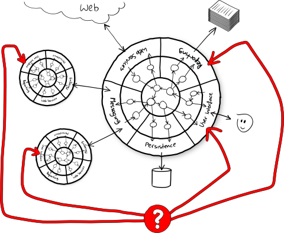

# Tester une application dans son ensemble

Lionel DURAND<!-- .element: class="auteur" -->

Avril 2023<!-- .element: class="date" -->

lioneldurand@gmail.com https://www.linkedin.com/in/lionel-durand-649b72193/
<!-- .element: class="auteur" -->

---

## Stratégie de tests  

Mobiliser différents types de tests pour couvrir au mieux les cas d'utilisation de l'application

* automatiques / manuels
* unitaires / d'intégration / système
* fonctionnels / non fonctionnels
* performance / sécurité
* etc...

--

## La pyramide de tests

--

## La bonne stratégie de tests ?

Celle construite en fonction du contexte de l'application et de l'équipe

* s'accorder sur une terminologie commune (c'est quoi un TU, un TI pour nous ?)
* optimiser coût/bénéfice
* penser à la stabilité et la maintenabilité
* penser au temps de feedback (le plus court possible)
* adresser les plus grosses douleurs du projet en premier

--

## La bonne stratégie de tests ?

La "pyramide de test" n'est pas un objectif en soi

Attention aux idées reçues
* "il faut toujours faire des TUs avec une couverture de 100%"
* "il ne faut que des tests automatiques"
* "il ne faut pas de tests manuels"
* "il faut des mocks partout"

--
## Ressources

[Livre blanc Culture Code](https://publication.octo.com/fr/telechargement-livre-blanc-culture-code) de Octo

---

## Kata "Roulette"

https://github.com/duduyo/kata-roulette-java

---

## Tests & architecture

Source: [The clean architecture, Uncle Bob](https://8thlight.com/blog/uncle-bob/2012/08/13/the-clean-architecture.html)

--

## Tests & architecture

Source: [Nat Pryces's version of the Port and Adapter architecture](http://www.natpryce.com/articles/000772.html)

--

## Tests unitaires

Source: [Nat Pryces](http://www.natpryce.com/articles/000772.html)

--

## Tests d'intégration

Source: [Nat Pryces](http://www.natpryce.com/articles/000772.html)

--

## Tests système

Source: [Nat Pryces](http://www.natpryce.com/articles/000772.html)

--

## Stratégie de tests Front ends ?

Une question d'architecture avant d'être une question d'outils

Séparer le code métier du code de présentation

* Au sein de l'application => DDD
* Au sein de chaque composant => sortir le code métier du composant graphique

=> Attention à l'adhérence avec les frameworks !

---

## Stratégie de tests Front ends ?

* Tester unitairement le code méter
* Tester les composants graphiques unitairement
  * pas forcément pour tous les composants
  * ne pas tester tous le rendu
* Tester les composants graphiques "par grappes"
* Tests end-to-end
  * sur des uses cases ciblés
  * peser le rapport coût/bénéfice/stabilités/maintenabilité des tests

--

## Stratégie de test back-end API

TODO

--

## Stratégie de test back traitement de donnée

TODO, ex batch python